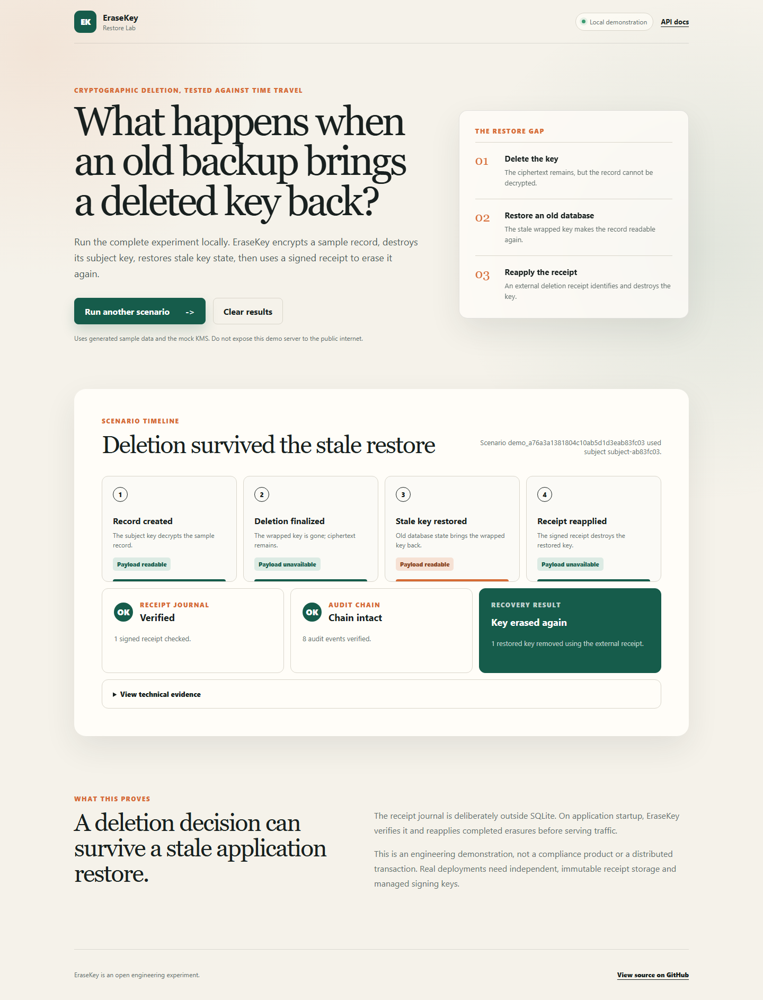

# EraseKey

EraseKey is a small FastAPI project that explores a specific failure mode in
cryptographic deletion: an old database snapshot can restore both encrypted data
and the wrapped key needed to read it.

The service encrypts records with per-subject data keys. Finalizing a deletion
removes those wrapped keys and writes a signed receipt outside the application
database. If stale database state later brings a key back, EraseKey can use the
receipt to find and destroy it again. The API verifies and reconciles the
receipt journal during startup before it begins serving requests.

## Why this project exists

Deleting a row from a live database says little about backups, replicas, or
exported copies. Envelope encryption offers a different control: keep the
ciphertext, but remove the key that makes it readable.

That still leaves a restore problem. If the wrapped key and the deletion record
live in the same database, rolling the database back can restore the key and
forget the deletion. EraseKey keeps a separate deletion receipt journal to carry
deletion intent across that boundary.

## What is implemented

- Tenant, dataset, and subject scoped records
- AES-256-GCM envelope encryption
- Mock and AWS KMS key providers
- Pending, scheduled, canceled, blocked, and finalized deletion states
- Legal holds and step-up checks for destructive operations
- Hash-chained audit events
- Signed deletion receipts with keyed subject references
- Idempotent receipt creation for safe finalization retries
- Write blocking for scheduled and deleted subjects
- Read-time receipt enforcement for resurrected keys
- Startup reconciliation of keys resurrected by a stale SQLite restore
- A local Restore Lab dashboard that demonstrates the complete failure and recovery path

## Restore Lab preview



A short animated run is available here: [`docs/assets/erasekey-restore-lab.gif`](docs/assets/erasekey-restore-lab.gif).
## How the restore flow works

```text
record -> subject data key -> wrapped by KMS provider
                              |
deletion finalized -----------+-> wrapped key removed
                              +-> signed receipt journal

stale database restore -> wrapped key returns
                       -> receipt still exists
                       -> reconciliation removes the key again
```

## Quick start

```bash
cd mvp/erasekey
python -m venv .venv

# Linux/macOS
source .venv/bin/activate

# Windows PowerShell
.\.venv\Scripts\Activate.ps1

pip install -r requirements.txt -r requirements-dev.txt
uvicorn app.main:app --reload
```

Open `http://127.0.0.1:8000/docs` for the generated API documentation.
Open `http://127.0.0.1:8000/dashboard` for the interactive Restore Lab.

## Public demo mode

For a hosted sandbox, run with `ERASEKEY_PUBLIC_DEMO_MODE=true`. Public demo
mode exposes only:

- `GET /`
- `GET /dashboard`
- `GET /healthz`
- `GET /static/*`
- `POST /demo/restore-scenario`

It blocks the raw API and `/docs`, adds basic browser security headers, and
rate-limits demo scenario runs. The included `Dockerfile` starts in this mode
with mock KMS, temporary container storage, and a non-root user.

The built-in rate limit is in memory and intended as a local safety rail. For a
public deployment, add provider-level or proxy-level rate limiting as well.

```bash
docker build -t erasekey-demo .
docker run --rm -p 8000:8000 erasekey-demo
```

Run the tests with:

```bash
python -m pytest -q tests
```

## Project map

- [`mvp/erasekey/README.md`](mvp/erasekey/README.md): configuration and deletion workflow
- [`mvp/erasekey/docs/architecture.md`](mvp/erasekey/docs/architecture.md): architecture and restore model
- [`mvp/erasekey/docs/api-spec.md`](mvp/erasekey/docs/api-spec.md): endpoint summary
- [`docs/adrs`](docs/adrs): design decisions and limitations

## Scope

This is an engineering demonstration, not a production privacy platform. The
API has no tenant authentication, the mock step-up verifier is not real
WebAuthn, and SQLite plus a local receipt file do not provide distributed
durability. See the architecture notes for the remaining trust and failure
boundaries.
